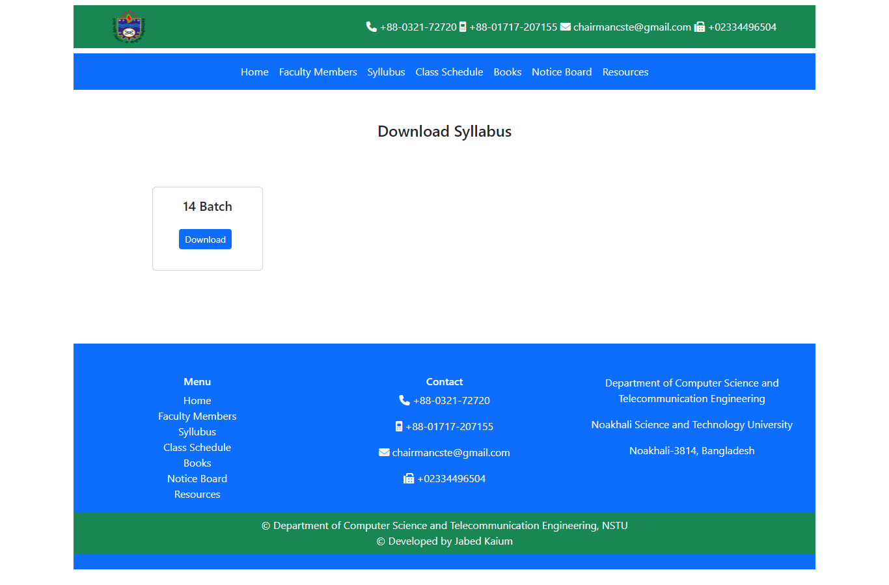

# CSTE-INFO

This is a web application based on Department of Computer Science and Telecommunication Engineering, NSTU.   Viewers can see necessary information and download files related to the department.

#### Technology used
Spring Boot, Spring Data JPA, Thymeleaf, HTML, CSS, JavaScript, MySQL

#### Key Features
<ul>
<li>Homepage contains overall introduction of department and upcoming events from Dept. of CSTE</li>
<li>Viewers can see all the faculty members and also see the profile of each faculty member</li>
<li>Download syllabus of individual batches</li>
<li>View class schedule of running batches</li>
<li>Download necessary books</li>
<li>Notice board</li>
<li>Download necessary resources</li>
</ul>

#### Admin Features
Add, Update and Delete
<ul>
<li>Faculty members</li>
<li>Syllabuses</li>
<li>Books</li>
<li>Resources</li>
<li>Notices</li>
<li>Class schedules</li>
<li>Events</li>
</ul>

#### Demo Screenshots

